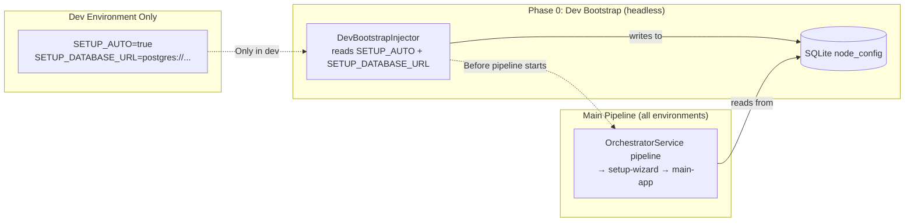
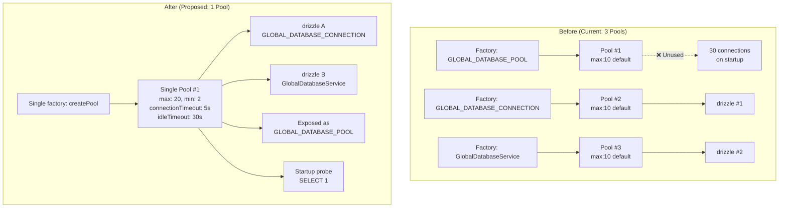
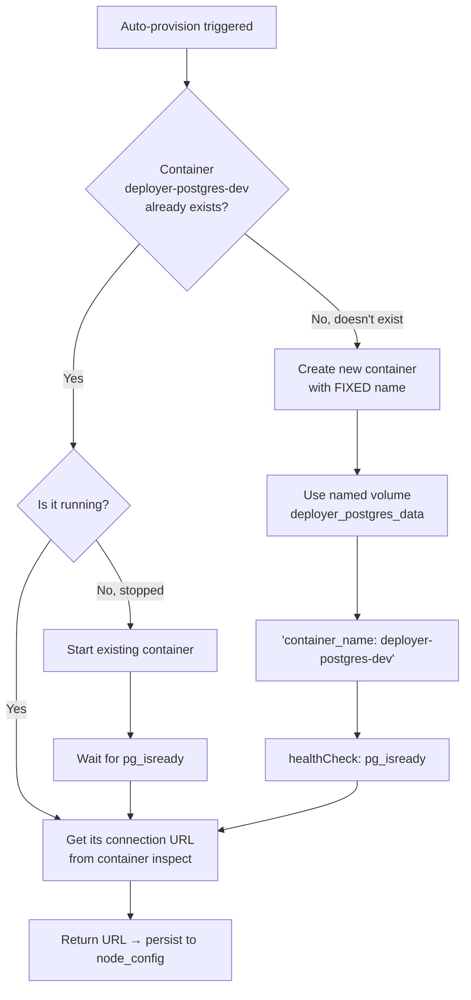
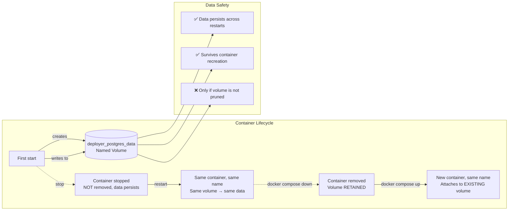
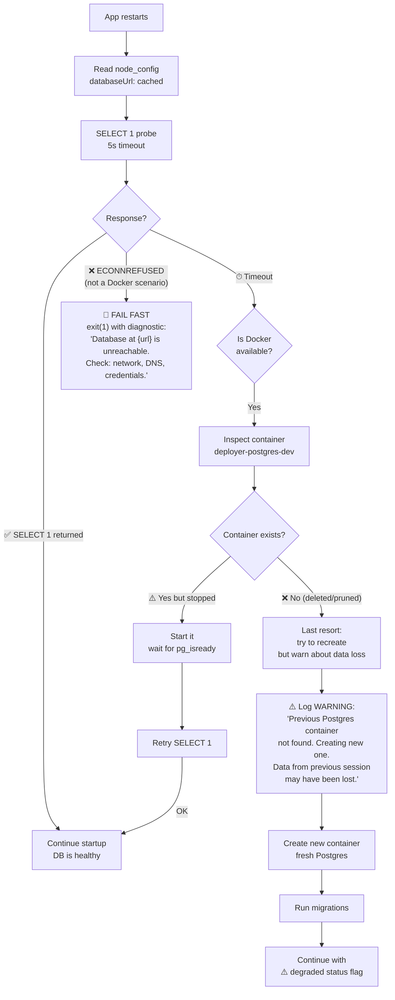

# Enhanced Database Connection Architecture — Proposal

> Based on deep analysis of the current codebase + research into best patterns for distributed NestJS/Postgres/SQLite systems. This document proposes a new architecture that is **fluent**, **fail-fast**, **resilient**, and handles **every startup scenario**.

---

## Part 1: Core Design Principles

### Principle P1: Fail Fast, Fail Loud
If the database is unreachable at startup, the app **must stop** with a clear diagnostic message. Never silently degrade at startup.

### Principle P2: Local Config Is the Starting Point — Then Act
Loading the local SQLite config is the very first thing the app does, but it does NOTHING with it yet. Only after reading whether setup is complete does it decide what to do.

### Principle P3: Mesh Peers From Local SQLite Are the Primary Reconnection Target
When reconnecting, the `meshUrlsSnapshot` from the local config is the first thing to try. If there are peers listed there, try them. Only fall back to the local `databaseUrl` cache if ALL local peers are unreachable.

### Principle P4: Global DB Peers Are a Secondary Discovery Source
Once you have a working Postgres connection (whether from mesh or local cache), query the `cluster_nodes` table for additional peers you might not know about. This keeps the local peer list up to date.

### Principle P5: You Can Run Alone — That's Valid
Being the only node in the mesh is a valid state. "You are alone" means you prepare for other nodes to join. It's not an error — it's the expected first-boot state for the first node.

### Principle P6: Single Shared Pool
One `pg.Pool` instance. Not three. The pool is created once, probed, then shared across all drizzle instances and services.

### Principle P7: No Database Duplication
Locally managed Postgres containers are **named** and **reused** across restarts. Never create a second Postgres if one already exists.

### Principle P8: Dev Bootstrap Injects Into Local Config Before Main Pipeline
Environment variables (`SETUP_DATABASE_URL`) are NEVER read by the main app. A dev-mode injector seeds the local SQLite before the main pipeline starts.

---

## Part 2: The Node Lifecycle State Machine

### Resolution Flow — Exact Pseudocode

```
START → load node_config from SQLite (no action yet)

  ┌── IF node_config.setupState == "setup_done" ──────────────────┐
  │                                                                │
  │  STEP 1: Get mesh peer URLs from local SQLite                  │
  │          (node_config.meshUrlsSnapshot)                        │
  │                                                                │
  │  ┌── IF there ARE peers in local SQLite ───────────────────┐   │
  │  │                                                         │   │
  │  │  Try connecting to ALL peers one by one                 │   │
  │  │                                                         │   │
  │  │  ┌── IF NONE worked (all unreachable) ──────────────┐   │   │
  │  │  │                                                    │   │   │
  │  │  │  Check local config for databaseUrl                │   │   │
  │  │  │                                                    │   │   │
  │  │  │  ┌── IF databaseUrl EXISTS ──────────────────┐    │   │   │
  │  │  │  │                                             │    │   │   │
  │  │  │  │  Try to connect to it (SELECT 1)            │    │   │   │
  │  │  │  │                                             │    │     │   │
  │  │  │  │  ┌── IF you CAN connect ────────────────┐  │    │   │   │
  │  │  │  │  │                                        │  │    │   │   │
  │  │  │  │  │  ✅ That's good — standalone mode      │  │    │   │   │
  │  │  │  │  │  Now check global DB for mesh peers    │  │    │   │   │
  │  │  │  │  │                                        │  │    │   │   │
  │  │  │  │  │  ┌── IF global DB has peers ──────┐   │  │    │   │   │
  │  │  │  │  │  │                                  │   │  │    │   │   │
  │  │  │  │  │  │  Try connecting to them          │   │  │    │   │   │
  │  │  │  │  │  │  ┌── IF none respond ────────┐   │   │  │    │   │   │
  │  │  │  │  │  │  │                             │   │   │  │    │   │   │
  │  │  │  │  │  │  │  ℹ️ They may be asleep or   │   │   │  │    │   │   │
  │  │  │  │  │  │  │  updating. Log warning but   │   │   │  │    │   │   │
  │  │  │  │  │  │  │  keep alive — you're stable  │   │   │  │    │   │   │
  │  │  │  │  │  │  └─────────────────────────────┘   │   │  │    │   │   │
  │  │  │  │  │  └────────────────────────────────────┘   │  │    │   │   │
  │  │  │  │  │                                            │  │    │   │   │
  │  │  │  │  └── IF you CAN'T connect ─────────────┐     │  │    │   │   │
  │  │  │  │  │                                        │    │  │    │   │   │
  │  │  │  │  │  ❌ PROBLEM: have DB URL from local    │    │  │    │   │   │
  │  │  │  │  │  config but can't connect to it         │    │  │    │   │   │
  │  │  │  │  │  → HARD STOP with diagnostic            │    │  │    │   │   │
  │  │  │  │  └────────────────────────────────────────┘    │  │    │   │   │
  │  │  │  └──────────────────────────────────────────────────┘  │    │   │   │
  │  │  │                                                         │    │   │   │
  │  │  └── ELSE (no databaseUrl in local config) ─────────┐     │    │   │   │
  │  │  │                                                    │     │    │   │   │
  │  │  │  ❌ ERROR STATE: setup_done but no DB URL and      │     │    │   │   │
  │  │  │  no reachable peers. This is an inconsistent state │     │    │   │   │
  │  │  │  → HARD STOP with diagnostic                       │     │    │   │   │
  │  │  └────────────────────────────────────────────────────┘     │    │   │   │
  │  │                                                               │    │   │   │
  │  └── ELSE (at least one peer worked) ───────────────────┐       │    │   │   │
  │                                                          │       │    │   │   │
  │     ✅ Mesh peer is reachable                            │       │    │   │   │
  │     → Request the database URL from the working peer     │       │    │   │   │
  │                                                          │       │    │   │   │
  │     ┌── IF peer can't respond with DB URL ──────────┐   │       │    │   │   │
  │     │                                                  │   │       │    │   │   │
  │     │  ❌ PROBLEM: mesh is reachable but can't          │   │       │    │   │   │
  │     │  provide a database URL. Cluster state is broken  │   │       │    │   │   │
  │     │  → HARD STOP                                      │   │       │    │   │   │
  │     └──────────────────────────────────────────────────┘   │       │    │   │   │
  │                                                          │       │    │   │   │
  │     └── ELSE (peer responds with URL) ───────────────┐   │       │    │   │   │
  │                                                        │   │       │    │   │   │
  │        Try to connect to the database                  │   │       │    │   │   │
  │                                                        │   │       │    │   │   │
  │        ┌── IF you CAN'T connect ──────────────────┐    │   │       │    │   │   │
  │        │                                            │    │   │       │    │   │   │
  │        │  ❌ PROBLEM: mesh gave a DB URL but        │    │   │       │    │   │   │
  │        │  that database is unreachable.              │    │   │       │    │   │   │
  │        │  → HARD STOP                                │    │   │       │    │   │   │
  │        └────────────────────────────────────────────┘    │   │       │    │   │   │
  │                                                        │   │       │    │   │   │
  │        └── IF you CAN connect ────────────────────┐    │   │       │    │   │   │
  │                                                      │    │   │       │    │   │   │
  │           ✅ Best case — everything works            │    │   │       │    │   │   │
  │           → Persist URL, update peer list,           │    │   │       │    │   │   │
  │             join mesh cluster                        │    │   │       │    │   │   │
  │        └──────────────────────────────────────────────┘    │   │       │    │   │   │
  │  └──────────────────────────────────────────────────────────┘   │       │    │   │   │
  │                                                                  │       │    │   │   │
  └── ELSE (no peers in local SQLite) ──────────────────────────┐    │       │    │   │   │
                                                                  │    │       │    │   │   │
    ┌── IF databaseUrl EXISTS in local config ────────────────┐   │    │       │    │   │   │
    │                                                          │   │    │       │    │   │   │
    │  Try to connect to it                                     │   │    │       │    │   │   │
    │                                                          │   │    │       │    │   │   │
    │  ┌── IF you CAN connect ──────────────────────────┐     │   │    │       │    │   │   │
    │  │                                                  │     │   │    │       │    │   │   │
    │  │  ✅ Connected to DB as standalone                 │     │   │    │       │    │   │   │
    │  │  Now query global DB for mesh peers               │     │   │    │       │    │   │   │
    │  │  (cluster_nodes table)                           │     │   │    │       │    │   │   │
    │  │                                                  │     │   │    │       │    │   │   │
    │  │  ┌── IF no peers in global DB ──────────────┐   │     │   │    │       │    │   │   │
    │  │  │                                            │   │     │   │    │       │    │   │   │
    │  │  │  ℹ️ You're alone. This is the first node  │   │     │   │    │       │    │   │   │
    │  │  │  in this mesh.                            │   │     │   │    │       │    │   │   │
    │  │  │  Prepare for other nodes to join YOUR     │   │     │   │    │       │    │   │   │
    │  │  │  mesh.                                    │   │     │   │    │       │    │   │   │
    │  │  └──────────────────────────────────────────┘   │     │   │    │       │    │   │   │
    │  │                                                  │     │   │    │       │    │   │   │
    │  │  ┌── ELSE peers exist in global DB ─────────┐   │     │   │    │       │    │   │   │
    │  │  │                                            │   │     │   │    │       │    │   │   │
    │  │  │  Try connecting to them one by one         │   │     │   │    │       │    │   │   │
    │  │  │                                            │   │     │   │    │       │    │   │   │
    │  │  │  ┌── IF none worked ──────────────────┐   │   │     │   │    │       │    │   │   │
    │  │  │  │                                      │   │   │     │   │    │       │    │   │   │
    │  │  │  │  ℹ️ They may be asleep or updating. │   │   │     │   │    │       │    │   │   │
    │  │  │  │  Log and wait for them to reappear. │   │   │     │   │    │       │    │   │   │
    │  │  │  │  When they do, add them to the      │   │   │     │   │    │       │    │   │   │
    │  │  │  │  local config meshUrlsSnapshot too.  │   │   │     │   │    │       │    │   │   │
    │  │  │  └────────────────────────────────────┘   │   │     │   │    │       │    │   │   │
    │  │  └──────────────────────────────────────────┘   │     │   │    │       │    │   │   │
    │  └──────────────────────────────────────────────────┘     │   │    │       │    │   │   │
    │                                                          │   │    │       │    │   │   │
    │  └── IF you CAN'T connect ────────────────────────┐     │   │    │       │    │   │   │
    │                                                      │     │   │    │       │    │   │   │
    │     ❌ PROBLEM: have DB URL from local config        │     │   │    │       │    │   │   │
    │     but can't connect to it                          │     │   │    │       │    │   │   │
    │     → HARD STOP with diagnostic                      │     │   │    │       │    │   │   │
    │  └────────────────────────────────────────────────────┘     │   │    │       │    │   │   │
    │                                                              │   │    │       │    │   │   │
    └── ELSE (no databaseUrl in local config) ──────────────┐     │   │    │       │    │   │   │
                                                              │     │   │    │       │    │   │   │
       ❌ ERROR: setup_done but no DB URL in local config     │     │   │    │       │    │   │   │
       AND no mesh peers. This is an IMPOSSIBLE state —       │     │   │    │       │    │   │   │
       you can't have setup complete without either a         │     │   │    │       │    │   │   │
       database URL or mesh peers.                            │     │   │    │       │    │   │   │
       → HARD STOP with diagnostic                            │     │   │    │       │    │   │   │
    └──────────────────────────────────────────────────────────┘     │   │    │       │    │   │   │
                                                                      │   │    │       │    │   │   │
  └── ELSE (setupState != "setup_done") ─────────────────────────┐     │   │    │       │    │   │   │
                                                                  │     │   │    │       │    │   │   │
     ⏩ Start setup wizard                                         │     │   │    │       │    │   │   │
     No configuration exists — guided onboarding                   │     │   │    │       │    │   │   │
  └────────────────────────────────────────────────────────────────┘     │   │    │       │    │   │   │
                                                                          │   │    │       │    │   │   │
└──────────────────────────────────────────────────────────────────────────────────────┘    │   │   │
                                                                                           │   │   │
                                                                                           ▼   ▼   ▼

DECISION: if at this point you have a working Postgres connection → proceed to HEALTHY
          If you don't → you already threw an error above
```
            │ │GOT │  │ HARD │ │USE │  │ SETUP    │            │
            │ │URL │  │ STOP │ │CACHE   │ WIZARD   │            │
            │ └┬───┘  │     │ │URL  │  └──────────┘            │
            │  │      └──────┘ └──┬───┘                        │
            │  ▼                  ▼                              │
            │ ┌──────────┐  ┌──────────────┐                    │
            │ │  PROBE   │  │   PROBE      │                    │
            │ │  URL     │  │   CACHE      │                    │
            │ │  FROM    │  │   URL        │                    │
            │ │  MESH    │  └──────┬───────┘                    │
            │ └────┬─────┘         │                            │
            │      │               │                            │
            │      ▼               ▼                            │
            │ ┌──────────┐   ┌──────────┐                       │
            │ │  ALIVE?  │   │  ALIVE?  │                       │
            │ └──┬──┬────┘   └──┬──┬────┘                       │
            │    │  │          │  │                             │
            │    ▼  ▼          ▼  ▼                             │
            │ ┌───┐ ┌──────┐ ┌───┐ ┌──────┐                    │
            │ │YES│ │NO    │ │YES│ │NO    │                    │
            │ └┬──┘ │HARD  │ └┬──┘ │FAIL  │                    │
            │  │   │STOP  │  │   │STOP  │                    │
            │  │   └──────┘  │   └──────┘                    │
            │  ▼             ▼                                │
            │ ┌───────┐  ┌───────┐                             │
            │ │ READY │  │ READY │                             │
            │ └───┬───┘  └───┬───┘                             │
            │     │          │                                 │
            │  ┌────────┐         │                            │
            │  │  MESH  │◄────────┘                            │
            │  │  PEER  │                                      │
            │  └───┬────┘                                      │
            │      │                                           │
            │      ▼                                           │
            │  ┌────────┐     ┌──────────────────┐            │
            │  │ HEALTHY│────►│  DB DISCONNECT   │────────────┘
            │  │        │     │  → circuit open  │
            │  └────────┘     └──────────────────┘
            │
            │  (Node upgrade or config change)
            │
            └──────────────────────────────────────────────────┘
```

### States That the App Can Be In After Resolution

| State | Meaning | How You Get Here |
|-------|---------|------------------|
| `SETUP_NEEDED` | No config exists at all | `setupState` != `setup_done` → launch setup wizard |
| `SETUP_INCONSISTENT` | Setup claims done but no DB URL and no peers | `setup_done` + no `databaseUrl` + no local peers → **HARD STOP**, impossible state |
| `STANDALONE_ALONE` | Connected to DB, first node in mesh | No peers anywhere → "You're alone. Prepare for other nodes to join YOUR mesh." |
| `STANDALONE_PEERS_ABSENT` | Connected to DB, but other nodes known in global DB aren't responding | Global DB has peers but none reachable → log "asleep/updating", keep alive, wait |
| `MESH_CONNECTED_HEALTHY` | Mesh peer found, DB works | Best case: peer reachable → gave DB URL → connected → join cluster |
| `MESH_GOT_URL_DB_DOWN` | Mesh peer reachable but DB URL it gave is unreachable | **HARD STOP** — mesh broke |
| `MESH_PEERS_DOWN_CACHE_OK` | Local peers all unreachable, cache DB reachable | Log "peers unreachable", check global DB for more peers, keep alive |
| `MESH_PEERS_DOWN_CACHE_GONE` | Local peers all unreachable, no cache DB | **HARD STOP** — inconsistent state |
| `CACHE_CONNECT_FAILED` | Have local DB URL but can't connect | **HARD STOP** with diagnostic |
| `CONNECTED_AND_STABLE` | Successfully connected to Postgres via any path | Proceed to create pool, register schema_version, start serving |

### Startup Decision Matrix

| Scenario | setupState | Local Peers? | Local DB URL? | Result State |
|----------|-----------|-------------|---------------|-------------|
| **Fresh install** | `not_started` | N/A | N/A | → SETUP_NEEDED → wizard |
| **Fresh + dev auto** | `setup_done` (injected) | No | Yes (injected) | → no peers → use cache → connect → check global DB → first node alone |
| **Restart, no peers, healthy** | `setup_done` | No | Yes, reachable | → no local peers → use cache → connect → check global DB → alone or peers absent |
| **Restart, no peers, DB gone** | `setup_done` | No | Yes, but **unreachable** | → HARD STOP: cache connect failed |
| **Restart, no peers, no DB URL** | `setup_done` | No | **No** | → **IMPOSSIBLE STATE**: HARD STOP |
| **Restart, with peers, healthy** | `setup_done` | Yes | Yes (cached) | → connect to peers → one works → request DB URL → connect → HEALTHY |
| **Restart, peers down, cache works** | `setup_done` | Yes | Yes, reachable | → all peers unreachable → use cache → connect OK → standalone, check global DB for more peers |
| **Restart, peers down, cache works, global DB has peers** | `setup_done` | Yes | Yes, reachable | → all peers unreachable → use cache → connect → global DB shows peers but none respond → log "asleep/updating", keep alive |
| **Restart, peers down, no cache** | `setup_done` | Yes | **No** | → all peers unreachable → no cache DB → HARD STOP |
| **Restart, peer gives bad DB URL** | `setup_done` | Yes | — | → peer reachable → peer returns URL → probe fails → HARD STOP |
| **Upgrade** | `upgrade_pending` | Yes | Yes | → connect to peers → get DB URL → connect → run migrations → HEALTHY |

---

## Part 3: Database URL Resolution Chain

```mermaid
flowchart TB
    START[START] --> LOAD[Load node_config from SQLite<br/>Do nothing yet]
    LOAD --> DONE{setupState =<br/>"setup_done"?}
    
    DONE -->|No| WIZARD["⏩ SETUP WIZARD<br/>No config exists"]
    DONE -->|Yes| GET_PEERS[Get meshUrlsSnapshot<br/>from local SQLite]
    
    GET_PEERS --> HAS_PEERS{Any peers in<br/>local SQLite?}
    
    HAS_PEERS -->|No| USE_CACHE["No local peers →<br/>use databaseUrl from config"]
    HAS_PEERS -->|Yes| TRY_PEERS[Try connecting to<br/>ALL local peers one by one]
    
    TRY_PEERS --> ANY_WORKED{At least one<br/>peer responded?}
    
    ANY_WORKED -->|No, all unreachable| CHECK_CACHE{Has local<br/>databaseUrl?}
    
    CHECK_CACHE -->|Yes| CONNECT_CACHE[Try connecting to<br/>cached databaseUrl]
    CONNECT_CACHE --> CACHE_OK{Connected?}
    CACHE_OK -->|Yes| CHECK_GLOBAL_DB["✅ Standalone with DB<br/>Now query global DB<br/>for more mesh peers"]
    CACHE_OK -->|No| CACHE_FAIL["❌ HARD STOP<br/>Have DB URL but<br/>can't connect"]
    
    CHECK_CACHE -->|No| INCONSISTENT["❌ IMPOSSIBLE STATE<br/>setup_done + no peers<br/>+ no DB URL"]
    
    ANY_WORKED -->|Yes| REQUEST_DB_URL[Request database URL<br/>from working peer]
    REQUEST_DB_URL --> PEER_GAVE_URL{Got a valid<br/>DB URL from peer?}
    PEER_GAVE_URL -->|No| PEER_BROKEN["❌ HARD STOP<br/>Mesh reachable but<br/>gave no DB URL"]
    PEER_GAVE_URL -->|Yes| CONNECT_PEER_DB[Connect to the<br/>database URL from mesh]
    CONNECT_PEER_DB --> PEER_DB_OK{Connected?}
    PEER_DB_OK -->|Yes| BEST_CASE["✅ BEST CASE<br/>Everything works<br/>→ join mesh cluster"]
    PEER_DB_OK -->|No| PEER_DB_FAIL["❌ HARD STOP<br/>Mesh gave a DB URL<br/>but DB is unreachable"]
    
    CHECK_GLOBAL_DB --> GLOBAL_HAS_PEERS{Any peers in<br/>cluster_nodes?}
    GLOBAL_HAS_PEERS -->|No| FIRST_NODE["ℹ️ You're the first node<br/>Prepare for others<br/>to join YOUR mesh"]
    GLOBAL_HAS_PEERS -->|Yes| TRY_GLOBAL_PEERS[Try connecting to<br/>global DB peers]
    TRY_GLOBAL_PEERS --> GLOBAL_WORKED{Any responded?}
    GLOBAL_WORKED -->|No| ASLEEP["ℹ️ Peers may be asleep<br/>or updating. Log warning,<br/>keep alive. Wait for them."]
    GLOBAL_WORKED -->|Yes| ADD_LOCAL[Add to local config<br/>meshUrlsSnapshot]
    ADD_LOCAL --> STABLE[✅ Stable with mesh peers]
    
    USE_CACHE --> CONNECT_CACHE
    
    style WIZARD fill:#f96,stroke:#333
    style INCONSISTENT fill:#d32,stroke:#333,color:#fff
    style CACHE_FAIL fill:#d32,stroke:#333,color:#fff
    style PEER_BROKEN fill:#d32,stroke:#333,color:#fff
    style PEER_DB_FAIL fill:#d32,stroke:#333,color:#fff
    style FIRST_NODE fill:#4caf,stroke:#333,color:#fff
    style ASLEEP fill:#ff98,stroke:#333
    style BEST_CASE fill:#4caf,stroke:#333,color:#fff
```

### Resolution Order Code

```typescript
async function resolveDatabaseUrl(): Promise<{
  url: string
  source: 'mesh' | 'cache'
  peers: string[]
} | 'setup_needed'> {

  const config = nodeConfigRepository.find()

  // ── NOT SETUP YET → setup wizard ──────────────────────────
  if (config?.setupState !== 'setup_done') {
    return 'setup_needed'
  }

  const localPeers: string[] = config?.meshUrlsSnapshot ?? []
  let databaseUrl: string | null = config?.databaseUrl?.trim() ?? null

  // ── PATH A: THERE ARE LOCAL PEERS → try mesh first ─────────
  if (localPeers.length > 0) {
    const workingPeer = await tryPeers(localPeers)

    if (workingPeer) {
      // At least one peer responded
      const meshDbUrl = await requestDatabaseUrlFromPeer(workingPeer)

      if (!meshDbUrl) {
        throw new Error(
          'Mesh peer is reachable but could not provide a database URL. ' +
          'Cluster state is broken — this peer should know the DB URL. ' +
          'Manual intervention required.'
        )
      }

      // Peer gave us a URL — verify it
      await probeDatabaseUrl(meshDbUrl, 'mesh')

      // Persist the URL and update peer list
      nodeConfigRepository.upsert({
        databaseUrl: meshDbUrl,
        meshUrlsSnapshot: await refreshPeerList(localPeers),
        ...
      })

      return { url: meshDbUrl, source: 'mesh', peers: localPeers }
    }

    // ── ALL PEERS UNREACHABLE → fall back to local cache ─────
    if (!databaseUrl) {
      throw new Error(
        'All known mesh peers are unreachable AND no database URL is stored locally.\n' +
        'This is an inconsistent state: setup is complete, peers are known but unreachable,\n' +
        'and there is no cached database URL to fall back to.\n' +
        `Attempted peers: ${localPeers.join(', ')}`
      )
    }

    await probeDatabaseUrl(databaseUrl, 'cache')

    // Connected using cache — now check global DB for more peers
    const globalPeers = await discoverGlobalMeshPeers()
    if (globalPeers.length > 0) {
      const anyGlobalResponded = await tryPeers(globalPeers)
      if (!anyGlobalResponded) {
        logger.warn(
          'Mesh peers from global DB are unreachable — they may be asleep or updating.\n' +
          'Keeping alive with cached database URL. Will retry periodically.\n' +
          `Known global peers: ${globalPeers.join(', ')}`
        )
      } else {
        // Update local snapshot with discovered peers
        nodeConfigRepository.upsert({
          meshUrlsSnapshot: [...new Set([...localPeers, ...globalPeers])],
          ...
        })
      }
    } else {
      logger.log('No other mesh peers found in global DB — you are the first/only node.')
    }

    return { url: databaseUrl, source: 'cache', peers: localPeers }
  }

  // ── PATH B: NO LOCAL PEERS → use cached databaseUrl ────────
  if (!databaseUrl) {
    throw new Error(
      'Setup is marked as complete but there is no database URL and no mesh peers.\n' +
      'This is an impossible state — you cannot have setup_done without either.\n' +
      'Check the local SQLite node_config table for corruption.'
    )
  }

  await probeDatabaseUrl(databaseUrl, 'cache')

  // Connected — discover peers from global DB
  const globalPeersFromDb = await discoverGlobalMeshPeers()
  if (globalPeersFromDb.length === 0) {
    logger.log(
      'ℹ️ Connected to database. No other mesh peers found.\n' +
      'You are the first node in this mesh. Prepare for other nodes to join.'
    )
  } else {
    const anyResponded = await tryPeers(globalPeersFromDb)
    if (!anyResponded) {
      logger.warn(
        'Found peers in global DB but none are responding.\n' +
        'They may be asleep or updating. Will retry periodically.'
      )
    }
    // Save peers to local config for next restart
    nodeConfigRepository.upsert({
      meshUrlsSnapshot: globalPeersFromDb,
      ...
    })
  }

  return { url: databaseUrl, source: 'cache', peers: globalPeersFromDb }
}
```

---

## Part 3.5: Dev-Mode Bootstrap Injector

### Principle

**The main app never reads `SETUP_DATABASE_URL`.** Environment variables are a development-only concern. In production, the URL comes from mesh discovery or is manually persisted via the CLI (`setup-db` command). The dev-mode bootstrap injector is a lightweight, headless step that runs **before the main pipeline** and seeds the local SQLite `node_config` with values from the environment.

### Architecture Diagram



### Design Rules

| Rule | Why |
|------|-----|
| **Dev bootstrap runs BEFORE the orchestrator pipeline** | The main app must never see `SETUP_DATABASE_URL`. By the time the orchestrator starts, the URL is already in SQLite — or it isn't. |
| **Dev bootstrap is a headless ApplicationContext** | Same pattern as `SetupDevService` today — create a minimal NestJS context with only `LocalDatabaseModule`, write to SQLite, destroy the context. No HTTP, no mesh, no Postgres. |
| **Dev bootstrap ONLY activates when NODE_ENV is not production** | Production deployments should never accidentally read dev env vars. Guard: `if (process.env.NODE_ENV === 'production') return`. |
| **Dev bootstrap does NOT fail if env vars are missing** | If `SETUP_AUTO` is not set or `SETUP_DATABASE_URL` is empty, it silently skips. The orchestrator will see no URL in SQLite and enter the setup wizard path. |

### Implementation

```typescript
// core/setup-dev/dev-bootstrap-injector.service.ts
// Runs as Phase 0 — headless NestJS ApplicationContext, no HTTP, no Postgres needed

@Injectable()
export class DevBootstrapInjector implements OnApplicationBootstrap {
  private readonly logger = new Logger(DevBootstrapInjector.name)

  constructor(
    private readonly nodeConfigRepository: NodeConfigRepository,
  ) {}

  async onApplicationBootstrap(): Promise<void> {
    // ── Guard: only run in dev mode ──────────────────────────────
    if (process.env.NODE_ENV === 'production') {
      this.logger.log('⏭ Production mode — skipping dev bootstrap injector')
      return
    }

    // ── Guard: only run when SETUP_AUTO is true ──────────────────
    if (process.env.SETUP_AUTO !== 'true') {
      this.logger.log('⏭ SETUP_AUTO not set — skipping dev bootstrap injector')
      return
    }

    const existing = this.nodeConfigRepository.find()

    // ── CASE 1: URL already in SQLite from a previous run ─────────
    if (existing?.databaseUrl?.trim()) {
      this.logger.log('♻️ Database URL already in node_config — dev bootstrap skipped')
      return
    }

    // ── CASE 2: SETUP_DATABASE_URL is set → inject into SQLite ───
    const envUrl = process.env.SETUP_DATABASE_URL?.trim()
    if (envUrl) {
      this.logger.log('📝 Injecting SETUP_DATABASE_URL into node_config (dev mode)')
      this.nodeConfigRepository.upsert({
        nodeId: existing?.nodeId ?? randomUUID(),
        strategy: 'local',
        setupState: 'setup_done',
        deployerVersion: DEPLOYER_VERSION,
        databaseUrl: envUrl,
        configuredAt: existing?.configuredAt ?? new Date().toISOString(),
        meshUrlsSnapshot: existing?.meshUrlsSnapshot ?? [],
        updatedAt: new Date().toISOString(),
      })
      this.logger.log('✅ Dev bootstrap complete — URL persisted to SQLite')
      return
    }

    // ── CASE 3: SETUP_AUTO=true but no SETUP_DATABASE_URL ────────
    // This is a local-only dev mode without Postgres (auto-provisioning
    // or SQLite-only testing). The setup wizard will handle this.
    this.logger.log(
      'ℹ️  SETUP_AUTO=true but no SETUP_DATABASE_URL. ' +
      'The setup wizard will handle auto-provisioning.'
    )
  }
}
```

### How the Pipeline Changes

```mermaid
flowchart TB
    BOOT[Container starts] --> DEV_CHECK{NODE_ENV<br/>= production?}
    
    DEV_CHECK -->|Yes, production| PIPELINE[Enter orchestrator pipeline<br/>Phase 0 → Phase 1 → ...]
    DEV_CHECK -->|No, dev mode| DEV_INJECTOR
    
    subgraph "Dev-Only Phase"
        DEV_INJECTOR[DevBootstrapInjector<br/>headless context]
        DEV_INJECTOR --> READS_SQLITE{node_config<br/>has databaseUrl?}
        READS_SQLITE -->|Already has it| SKIP[⏭ Skip, nothing to do]
        READS_SQLITE -->|Empty| READS_ENV{SETUP_AUTO<br/>= true?}
        READS_ENV -->|Yes + SETUP_DATABASE_URL set| WRITE_SQLITE[Write URL to node_config]
        READS_ENV -->|Yes, no URL| SKIP_AUTO[⏭ Will use setup wizard]
        READS_ENV -->|No| SKIP_AUTO
        WRITE_SQLITE --> CLOSE[ctx.close() → destroy context]
        SKIP --> CLOSE
        SKIP_AUTO --> CLOSE
    end
    
    CLOSE --> PIPELINE
    
    subgraph "Orchestrator Pipeline (env-blind)"
        PIPELINE --> RESOLVE[resolveDatabaseUrl<br/>reads setupState + peers + databaseUrl]
        RESOLVE --> IS_DONE{setupState =<br/>setup_done?}
        IS_DONE -->|No| WIZARD[Setup wizard]
        IS_DONE -->|Yes| PATH[Follow peer/cache logic<br/>→ probe DB → ready]
    end
```

### What This Replaces

This dev-mode injector **replaces** the current `SetupDevService` behavior of reading `SETUP_DATABASE_URL` during Phase 0. The difference:

| Aspect | Current SetupDevService | New DevBootstrapInjector |
|--------|------------------------|--------------------------|
| Scope | Always runs (even in prod) | **Only runs in dev** (NODE_ENV !== 'production') |
| URL source | `SETUP_DATABASE_URL` env | Same — but main app never sees env |
| Failure mode | Logs warning, continues | Same — silent skip if env not set |
| Main app awareness | Main app's `InitializationService` also checks env vars | **Main app never reads env** — only reads SQLite |
| Flow position | In orchestrator Phase 0 | **Before** orchestrator pipeline entirely |
| Test isolation | Main app can accidentally depend on env | Main app is purely SQLite-driven → easily testable |

### Impact on Existing Code

The `InitializationService.checkConfigAndEmit()` method currently has a code path that reads `SETUP_DATABASE_URL` and `SETUP_AUTO` directly:

```typescript
// Current — REMOVE this code path
} else if ((process.env.SETUP_AUTO === "true" || ...) && process.env.SETUP_DATABASE_URL) {
    // Dev-mode auto-setup — this is now handled by DevBootstrapInjector
}
```

With the new architecture, `InitializationService` is simplified: it only reads `node_config` from SQLite and never touches `process.env`:

```typescript
// New InitializationService.checkConfigAndEmit() — env-blind
checkConfigAndEmit(): void {
  const config = this.nodeConfigRepository.find()
  if (config?.configuredAt) {
    // Node is configured — emit completion
    this.emitCompleted({ ... })
    return
  }
  // No config found — setup wizard required (or dev bootstrap didn't run)
  this.logger.log('⏳ No config found — setup wizard required')
}
```

---

## Part 4: Single Shared Pool Architecture



### Proposed Module Structure

```typescript
// global-database.module.ts — NEW version with shared pool

const SHARED_POOL: Pool | null = null  // module-scoped singleton

function createPool(databaseUrl: string): Pool {
  return new Pool({
    connectionString: databaseUrl,
    max: 20,
    min: 2,
    connectionTimeoutMillis: 5_000,   // Fail fast: no infinite wait
    idleTimeoutMillis: 30_000,         // Recycle idle connections
    maxUses: 7_500,                    // Prevent connection memory bloat
    application_name: 'deployer-api',  // Shows in pg_stat_activity
    allowExitOnIdle: true,
  })
}

async function probeDatabase(databaseUrl: string): Promise<void> {
  const probePool = new Pool({
    connectionString: databaseUrl,
    max: 1,
    connectionTimeoutMillis: 5_000,
    idleTimeoutMillis: 1_000,
    allowExitOnIdle: true,
  })
  
  try {
    const start = Date.now()
    await probePool.query('SELECT 1')
    const latency = Date.now() - start
    logger.log(`✅ Database reachable (${latency}ms)`)
  } catch (err: unknown) {
    const message = err instanceof Error ? err.message : String(err)
    const diagnostic = categorizeDatabaseError(message)
    logger.error(`❌ Database unreachable: ${diagnostic}`)
    throw new Error(diagnostic)  // ← Fail fast: module init fails, app stops
  } finally {
    await probePool.end().catch(() => undefined)
  }
}

function categorizeDatabaseError(message: string): string {
  if (message.includes('ECONNREFUSED'))
    return 'Connection refused — is the database server running? Check: host, port, and that the container is up.'
  if (message.includes('ETIMEDOUT') || message.includes('timeout'))
    return 'Connection timed out — check firewall rules and network connectivity.'
  if (message.includes('ENOTFOUND'))
    return 'Hostname could not be resolved — check DNS or docker network configuration.'
  if (message.includes('password') || message.includes('authentication'))
    return 'Authentication failed — verify username and password in the connection string.'
  if (message.includes('does not exist'))
    return 'Database does not exist — verify the database name in the connection string.'
  return `Unknown database error: ${message}`
}

@Global()
@Module({ ... })
export class GlobalDatabaseModule {
  static async forRoot(nodeConfig: NodeConfigRepository): Promise<DynamicModule> {
    const url = nodeConfig.find()?.databaseUrl?.trim()
    if (!url) {
      throw new Error('Cannot initialize GlobalDatabaseModule: no database URL in node_config')
    }
    
    // ── PROBE FIRST: fail fast if DB unreachable ───────────
    await probeDatabase(url)
    
    // ── Create shared pool ─────────────────────────────────
    const pool = createPool(url)
    
    // ── Pool error handling ────────────────────────────────
    pool.on('error', (err) => {
      logger.error(`🚨 Pool error: ${err.message}`)
      // Circuit breaker would trip here
    })
    
    return {
      module: GlobalDatabaseModule,
      providers: [
        { provide: GLOBAL_DATABASE_POOL, useValue: pool },
        { provide: GLOBAL_DATABASE_CONNECTION, useFactory: (p: Pool) => drizzle(p, { schema: globalSchema }), inject: [GLOBAL_DATABASE_POOL] },
        { provide: GlobalDatabaseService, useFactory: (p: Pool) => new GlobalDatabaseService(drizzle(p, { schema: globalSchema })), inject: [GLOBAL_DATABASE_POOL] },
      ],
      exports: [GlobalDatabaseService, GLOBAL_DATABASE_CONNECTION, GLOBAL_DATABASE_POOL],
    }
  }
}
```

---

## Part 5: Enhanced Startup State Machine

```typescript
// app-lifecycle-state.service.ts — New centralized state manager

type NodePhase =
  | 'boot'              // Process started
  | 'discovering'       // Resolving database URL
  | 'probing'           // Testing DB connectivity
  | 'ready'             // Pool created, DB reachable
  | 'joining_mesh'      // Connecting to mesh peers
  | 'healthy'           // Fully operational
  | 'degraded'          // DB was lost mid-run, recovery loop
  | 'failed'            // Fatal error — will exit
  | 'shutting_down'     // Graceful shutdown in progress

interface NodeState {
  phase: NodePhase
  databaseUrl: string | null
  databaseReachable: boolean | null
  meshConnected: boolean
  lastKnownGoodAt: string | null    // ISO timestamp
  startedAt: string                 // ISO timestamp
  error: string | null
  configStrategy: 'local' | 'remote' | null
}

@Injectable()
export class AppLifecycleStateService {
  private state: NodeState

  constructor() {
    this.state = {
      phase: 'boot',
      databaseUrl: null,
      databaseReachable: null,
      meshConnected: false,
      lastKnownGoodAt: null,
      startedAt: new Date().toISOString(),
      error: null,
      configStrategy: null,
    }
  }

  transition(phase: NodePhase, metadata?: Partial<NodeState>): void {
    const from = this.state.phase
    this.state = { ...this.state, phase, ...metadata }
    this.logger.log(`🔄 State: ${from} → ${phase}${metadata?.error ? ` ❌ ${metadata.error}` : ''}`)
    
    // If transitioning to 'failed', trigger shutdown
    if (phase === 'failed') {
      this.logger.error(`🚨 Fatal error: ${metadata?.error}`)
      process.exit(1)  // ← Fail fast
    }
  }

  getState(): Readonly<NodeState> {
    return this.state
  }
}

// OrchestratorService — Updated startup flow
async onApplicationBootstrap(): Promise<void> {
  this.lifecycle.transition('discovering')
  
  // ── Step 1: Resolve database URL ────────────────────────────
  const url = await this.resolveDatabaseUrl()
  
  if (!url) {
    this.lifecycle.transition('boot', { error: 'No database URL found' })
    // Start setup wizard instead of failing
    await this.startSetupWizard()
    return
  }
  
  // ── Step 2: Probe database ──────────────────────────────────
  this.lifecycle.transition('probing', { databaseUrl: url })
  const probeResult = await this.probeDatabase(url)
  
  if (!probeResult.reachable) {
    this.lifecycle.transition('failed', { 
      error: probeResult.error,
      databaseReachable: false,
    })
    // process.exit(1) is called inside transition('failed')
    return  // ← Never reached
  }
  
  this.lifecycle.transition('ready', { 
    databaseReachable: true,
    lastKnownGoodAt: new Date().toISOString(),
  })
  
  // ── Step 3: Create pool & start main app ────────────────────
  await this.startMainApp()
  
  // ── Step 4: Connect to mesh ─────────────────────────────────
  this.lifecycle.transition('joining_mesh')
  await this.connectToMesh()
  
  this.lifecycle.transition('healthy', { meshConnected: true })
}
```

---

## Part 6: Local Database Auto-Provisioning (Improved)

### Problem with Current Implementation

The current `PostgresContainerService.startPostgresContainer()` creates a container with `autoRemove: true` and a random UUID name. This means:
- Container name changes every time → Docker leaves orphan containers
- `autoRemove: true` → container is deleted when stopped → data lost unless using volumes
- Volume name is not explicitly set → Docker generates random volume names

### Proposed Improvement



### Implementation

```typescript
// enhanced-postgres-container.service.ts
const MANAGED_CONTAINER_NAME = 'deployer-postgres-dev'
const MANAGED_VOLUME_NAME = 'deployer_postgres_data'

async ensurePostgresRunning(): Promise<string> {
  const docker = this.dockerService.getDockerClient()
  
  // ── Step 1: Check for existing container ──────────────────
  try {
    const existing = docker.getContainer(MANAGED_CONTAINER_NAME)
    const info = await existing.inspect()
    
    if (info.State.Running) {
      // Already running — return its connection URL
      this.logger.log('♻️ Reusing existing Postgres container')
      return this.buildConnectionUrl(info)
    }
    
    // Container exists but stopped — restart it
    this.logger.log('🔄 Restarting stopped Postgres container')
    await existing.start()
    await this.waitForPostgresReady(existing)
    return this.buildConnectionUrl(info)
    
  } catch (err: unknown) {
    // Container doesn't exist — need to create it
    if (err instanceof Error && err.message.includes('no such container')) {
      this.logger.log('📦 Creating new Postgres container')
      return this.createPostgresContainer(docker)
    }
    throw err
  }
}

private async createPostgresContainer(docker: Dockerode): Promise<string> {
  // Ensure named volume exists
  const volumes = await docker.listVolumes()
  const hasVolume = volumes.Volumes?.some(v => v.Name === MANAGED_VOLUME_NAME)
  if (!hasVolume) {
    await docker.createVolume({ Name: MANAGED_VOLUME_NAME })
    this.logger.log(`📀 Created named volume: ${MANAGED_VOLUME_NAME}`)
  }
  
  // Create container with FIXED name
  const container = await docker.createContainer({
    name: MANAGED_CONTAINER_NAME,
    Image: 'postgres:16-alpine',
    Env: [
      'POSTGRES_DB=deployer',
      'POSTGRES_USER=deployer',
      'POSTGRES_PASSWORD=deployer',
    ],
    HostConfig: {
      PortBindings: { '5432/tcp': [{ HostPort: '5432' }] },
      Binds: [`${MANAGED_VOLUME_NAME}:/var/lib/postgresql/data`],
      AutoRemove: false,  // ← CRITICAL: don't delete on stop
    },
    Healthcheck: {
      Test: ['CMD-SHELL', 'pg_isready -U deployer -d deployer'],
      Interval: 1_000_000_000,
      Timeout: 5_000_000_000,
      Retries: 30,
      StartPeriod: 5_000_000_000,
    },
  })
  
  await container.start()
  await this.waitForPostgresReady(container)
  return this.buildConnectionUrl(await container.inspect())
}
```

### Volume Persistence Strategy



---

## Part 7: Health Check & Resilience

### Enhanced Health Check Endpoint

```typescript
// health.controller.ts — Returns full node state
@Get('/health')
async health(): Promise<HealthResponse> {
  const state = this.lifecycle.getState()
  
  return {
    status: state.phase === 'healthy' ? 'healthy' 
          : state.phase === 'degraded' ? 'degraded' 
          : 'starting',
    phase: state.phase,
    uptime: Math.floor((Date.now() - new Date(state.startedAt).getTime()) / 1000),
    database: {
      configured: state.databaseUrl !== null,
      reachable: state.databaseReachable,
      lastKnownGood: state.lastKnownGoodAt,
    },
    mesh: {
      connected: state.meshConnected,
      strategy: state.configStrategy,
    },
    version: DEPLOYER_VERSION,
  }
}
```

### Circuit Breaker for DB Operations

```typescript
// db-circuit-breaker.service.ts
@Injectable()
export class DatabaseCircuitBreaker {
  private state: 'closed' | 'open' | 'half-open' = 'closed'
  private failureCount = 0
  private lastFailureTime = 0
  private readonly threshold = 5
  private readonly resetTimeoutMs = 30_000
  private recoveryTimer: ReturnType<typeof setTimeout> | null = null

  constructor(
    private readonly lifecycle: AppLifecycleStateService,
    private readonly pool: Pool,
  ) {
    // Listen for pool errors
    this.pool.on('error', () => this.recordFailure())
  }

  async execute<T>(operation: string, fn: () => Promise<T>): Promise<T> {
    if (this.state === 'open') {
      const elapsed = Date.now() - this.lastFailureTime
      if (elapsed < this.resetTimeoutMs) {
        throw new ServiceUnavailableError(
          `Database unavailable (circuit open for ${Math.round((this.resetTimeoutMs - elapsed) / 1000)}s more)`
        )
      }
      this.state = 'half-open'
    }

    try {
      const result = await fn()
      this.onSuccess()
      return result
    } catch (err) {
      this.recordFailure()
      throw err
    }
  }

  private onSuccess(): void {
    if (this.state === 'half-open') {
      this.lifecycle.transition('healthy', { databaseReachable: true })
    }
    this.failureCount = 0
    this.state = 'closed'
    if (this.recoveryTimer) {
      clearTimeout(this.recoveryTimer)
      this.recoveryTimer = null
    }
  }

  private recordFailure(): void {
    this.failureCount++
    this.lastFailureTime = Date.now()

    if (this.failureCount >= this.threshold) {
      this.state = 'open'
      this.lifecycle.transition('degraded', {
        databaseReachable: false,
        error: `Circuit breaker opened after ${this.failureCount} failures`,
      })
      this.scheduleRecovery()
    }
  }

  private scheduleRecovery(): void {
    const delay = Math.min(1_000 * 2 ** Math.min(this.failureCount - this.threshold, 5), 30_000)
    this.recoveryTimer = setTimeout(async () => {
      try {
        const probePool = new Pool({
          connectionString: this.pool.config.connectionString!,
          max: 1,
          connectionTimeoutMillis: 3_000,
        })
        await probePool.query('SELECT 1')
        await probePool.end()
        this.onSuccess()
      } catch {
        this.scheduleRecovery()  // Exponential backoff
      }
    }, delay)
  }
}
```

### Pool Drain on Shutdown

```typescript
// main.ts shutdown handler — NEW with proper pool drain
async function gracefulShutdown(signal: string) {
  log.info(`${signal} received — draining connections…`)
  
  // 1. Stop accepting new requests
  server.close()
  
  // 2. Drain Postgres pool
  try {
    await pool.end()
    log.info('✅ Postgres pool drained')
  } catch (err) {
    log.error('Error draining Postgres pool', err)
  }
  
  // 3. Close SQLite
  try {
    sqlite.close()
    log.info('✅ SQLite closed')
  } catch { /* best effort */ }
  
  // 4. Force exit after timeout
  setTimeout(() => process.exit(1), 30_000).unref()
}
```

---

## Part 8: Handling DB Disappearance at Restart

When the app restarts and the database URL from `node_config` points to a database that no longer exists:



### Implementation

```typescript
// database-startup-guard.service.ts
@Injectable()
export class DatabaseStartupGuard {
  async ensureDatabaseAvailable(nodeConfig: NodeConfigRepository): Promise<void> {
    const url = nodeConfig.find()?.databaseUrl?.trim()
    if (!url) return  // No DB configured — skip guard
    
    const probeResult = await this.probe(url)
    if (probeResult.reachable) return  // ✅ All good
    
    // ── DB unreachable — try to recover if Docker is available ──
    if (await this.isDockerAvailable()) {
      const recovered = await this.tryDockerRecovery()
      if (recovered) {
        logger.warn('⚠️ Database recovered via Docker — data may have been lost')
        return
      }
    }
    
    // ── Cannot recover — fail fast ─────────────────────────────
    const diagnostic = this.buildDiagnostic(url, probeResult.error!)
    logger.error(diagnostic)
    throw new Error(diagnostic)
  }
  
  private async tryDockerRecovery(): Promise<boolean> {
    try {
      const docker = new Dockerode()
      const container = docker.getContainer('deployer-postgres-dev')
      const info = await container.inspect()
      
      if (info.State.Running) {
        // Running but not responding — something else is wrong
        return false
      }
      
      // Container exists but stopped — restart it
      logger.log('🔄 Restarting stopped Postgres container...')
      await container.start()
      await this.waitForPostgres(container)
      return true
      
    } catch (err: unknown) {
      if (err instanceof Error && err.message.includes('no such container')) {
        // Container was deleted — could recreate but data is lost
        logger.warn('❌ Postgres container not found — cannot recover automatically')
        return false
      }
      logger.error(`Docker recovery error: ${(err as Error).message}`)
      return false
    }
  }
  
  private buildDiagnostic(url: string, error: string): string {
    const redacted = url.replace(/\/\/[^:]+:[^@]+@/, '//***:***@')
    return [
      `━━━━━━━━━━━━━━━━━━━━━━━━━━━━━━━━━━━━━━━━━━━`,
      `❌ DATABASE CONNECTION FAILED`,
      `━━━━━━━━━━━━━━━━━━━━━━━━━━━━━━━━━━━━━━━━━━━`,
      `  URL: ${redacted}`,
      `  Error: ${error}`,
      ``,
      `  Possible causes:`,
      `  • Database container stopped or deleted`,
      `  • Network changed (new Docker network IP range)`,
      `  • Credentials rotated but node_config not updated`,
      `  • Host not reachable from this container`,
      ``,
      `  Actions:`,
      `  1. Check if the database is running: docker ps | grep postgres`,
      `  2. Verify network: docker network ls`,
      `  3. Run setup-db again: bun run db:setup --url="postgres://..."`,
      `  4. Or reset and re-run setup wizard`,
      `━━━━━━━━━━━━━━━━━━━━━━━━━━━━━━━━━━━━━━━━━━━`,
    ].join('\n')
  }
}
```

---

## Part 9: Proposed File Changes Summary

| File | Action | Change |
|------|--------|--------|
| `apps/api/src/core/modules/database/global/global-database.module.ts` | **Rewrite** | Single shared pool, probe after init (not in forRoot), fail fast |
| `apps/api/src/core/modules/database/shared/database.service.ts` | **Update** | Fix empty `catch {}`, add proper error logging |
| `apps/api/src/core/modules/database/database-connection.ts` | **Keep** | Tokens stay, but consolidate to single pool |
| `apps/api/src/core/orchestrator/orchestrator.service.ts` | **Update** | Add dev bootstrap phase + fail-fast probe before main-app starts |
| `apps/api/src/core/modules/docker/containers/postgres/postgres-container.service.ts` | **Rewrite** | Fixed container name, named volume, reuse existing |
| `apps/api/src/main.ts` | **Update** | Add pool drain + SQLite close on shutdown |
| `apps/api/src/core/modules/setup/services/initialization.service.ts` | **Update** | Remove all `process.env.SETUP_DATABASE_URL` / `SETUP_AUTO` refs — env-blind |
| `apps/api/src/core/modules/setup/services/local-initialization.service.ts` | **Update** | Use new PostgresContainerService pattern |
| `apps/api/src/core/setup-dev/setup-dev.service.ts` | **Rewrite → DevBootstrapInjector** | Only runs in dev mode (NODE_ENV guard), moves env-reading BEFORE main pipeline |
| `apps/api/src/core/modules/database/services/database-probe.service.ts` | **New** | Reusable DB probe with categorized errors |
| `apps/api/src/core/modules/lifecycle/app-lifecycle-state.service.ts` | **New** | Centralized state machine (event-based, no process.exit) |
| `apps/api/src/core/modules/database/services/database-failure-tracker.service.ts` | **New** | Failure tracker (observer pattern, no state co-ownership) |
| `apps/api/src/core/modules/database/services/database-startup-guard.service.ts` | **New** | Fail-fast guard with Docker recovery |
| `apps/api/src/core/modules/setup/repositories/node-config.repository.ts` | **Update** | Add `lastKnownGoodAt` field support |

---

## Part 10: Advisor Review — Corrections & Amendments

> The architecture above was reviewed by a senior architect. Below are the corrections and gaps identified.

### 🔴 Correction 1: `process.exit(1)` Inside State Machine

**Original**: `AppLifecycleStateService.transition('failed')` calls `process.exit(1)` directly.

**Problem**: Side effect in a state setter. Makes the state machine untestable and surprising. Unit tests that transition to `failed` kill the test runner.

**Fix**: The state machine fires events. The orchestrator subscribes and decides whether to exit.

```typescript
// AppLifecycleStateService — pure state, no side effects
transition(phase: NodePhase, metadata?: Partial<NodeState>): void {
  const from = this.state.phase
  this.state = { ...this.state, phase, ...metadata }
  this.logger.log(`🔄 State: ${from} → ${phase}`)
  this.eventBus.emit('lifecycle.transition', { from, to: phase, state: this.state })
  // ↑ Fire event, don't kill process
}

// OrchestratorService — decides what to DO with state changes
@OnEvent('lifecycle.transition')
handleTransition({ to }: LifecycleTransitionEvent): void {
  if (to === 'failed') {
    this.logger.error(this.state.getState().error)
    this.gracefulShutdown('FATAL').then(() => process.exit(1))
  }
}
```

### 🔴 Correction 2: Probe After Module Init, Not Inside `forRoot()`

**Original**: `GlobalDatabaseModule.forRoot()` is async and calls `probeDatabase()` before returning.

**Problem**: If probe fails inside `forRoot`, NestJS wraps it in a generic DI error. The structured diagnostic is lost. Also creates a wasteful temporary pool just for probing.

**Fix**: Create the pool synchronously (module init is simple), then probe inside the orchestrator _after_ module init using the real pool's first connection.

```typescript
// GlobalDatabaseModule — synchronous, no probe
static forRoot(nodeConfig: NodeConfigRepository): DynamicModule {
  const url = nodeConfig.find()?.databaseUrl?.trim()
  if (!url) throw new Error('No DB URL in node_config')
  
  const pool = new Pool({
    connectionString: url,
    max: 20, min: 2,
    connectionTimeoutMillis: 5_000,
    idleTimeoutMillis: 30_000,
    allowExitOnIdle: true,
  })
  
  return {
    module: GlobalDatabaseModule,
    providers: [
      { provide: GLOBAL_DATABASE_POOL, useValue: pool },
      { provide: GLOBAL_DATABASE_CONNECTION, useFactory: (p: Pool) => drizzle(p, { schema: globalSchema }), inject: [GLOBAL_DATABASE_POOL] },
      { provide: GlobalDatabaseService, useFactory: (p: Pool) => new GlobalDatabaseService(drizzle(p, { schema: globalSchema })), inject: [GLOBAL_DATABASE_POOL] },
    ],
    exports: [GlobalDatabaseService, GLOBAL_DATABASE_CONNECTION, GLOBAL_DATABASE_POOL],
  }
}

// OrchestratorService — probe AFTER init using the real pool
async onApplicationBootstrap(): Promise<void> {
  await this.probeDatabase(this.pool)  // use the REAL pool's first connection
  this.lifecycle.transition('ready')
}

private async probeDatabase(pool: Pool): Promise<void> {
  const client = await pool.connect()
  try {
    await client.query('SELECT 1')
    this.lifecycle.transition('ready', { databaseReachable: true })
  } catch (err) {
    await pool.end()
    this.lifecycle.transition('failed', { error: categorize(err) })
  } finally {
    client.release()
  }
}
```

### 🔴 Correction 3: Circuit Breaker as Observer, Not Co-Owner

**Original**: `DatabaseCircuitBreaker` owns a parallel `state` field AND calls `lifecycle.transition()`.

**Problem**: Dual state that can diverge. Two sources of truth for DB health.

**Fix**: Strip to a `DatabaseFailureTracker` that only counts failures + schedules recovery. The lifecycle state machine is the sole source of truth.

```typescript
@Injectable()
export class DatabaseFailureTracker {
  private failureCount = 0
  private readonly threshold = 5
  private readonly resetTimeoutMs = 30_000
  private recoveryTimer: ReturnType<typeof setTimeout> | null = null

  constructor(private readonly lifecycle: AppLifecycleStateService) {}

  // Called by pool error handler or query interceptor
  recordFailure(): void {
    this.failureCount++
    if (this.failureCount >= this.threshold) {
      this.lifecycle.transition('degraded', {
        error: `${this.failureCount} consecutive failures`,
      })
      this.scheduleRecovery()
    }
  }

  recordSuccess(): void {
    this.failureCount = 0
    if (this.lifecycle.getState().phase === 'degraded') {
      this.lifecycle.transition('healthy')
    }
    if (this.recoveryTimer) {
      clearTimeout(this.recoveryTimer)
      this.recoveryTimer = null
    }
  }

  private scheduleRecovery(): void {
    const delay = Math.min(1_000 * 2 ** Math.min(this.failureCount - 5, 5), 30_000)
    this.recoveryTimer = setTimeout(async () => {
      const client = await this.pool.connect().catch(() => null)
      if (client) {
        client.release()
        this.recordSuccess()
      } else {
        this.scheduleRecovery()  // Exponential backoff
      }
    }, delay)
  }
}
```

### 🟠 Correction 4: Remove Module-Scoped Singleton

**Original**: `const SHARED_POOL: Pool | null = null` as module-level variable.

**Problem**: Breaks test isolation and HMR. The pool should be DI-managed.

**Fix**: The factory functions receive the pool via DI. The pool is created once as a provider value and injected everywhere.

### 🟠 Correction 5: Decouple Docker Recovery from Guard

**Original**: `DatabaseStartupGuard.tryDockerRecovery()` tries to restart a Docker container.

**Problem**: Concern mixing — the guard should answer "is DB reachable?", not manage containers.

**Fix**: The orchestrator coordinates:
```
orchestrator → guard.probe() → fails
             → postgresContainerService.ensureRunning() → restarts container
             → guard.probe() → succeeds → continue
             → guard.probe() → fails → lifecycle.transition('failed')
```

### 🟢 Gap 6: Add Startup Probe Retry

A single `SELECT 1` with 5s timeout can fail on transient Docker networking. Add 3 retries:
```
Attempt 1: 5s timeout → fail → wait 1s
Attempt 2: 5s timeout → fail → wait 2s
Attempt 3: 5s timeout → fail → STOP with diagnostic
```

### 🟢 Gap 7: Add `acquireTimeoutMillis`

Without it, pool acquisition queues indefinitely when all connections are busy. Add:
```typescript
new Pool({
  ...,
  acquireTimeoutMillis: 10_000,  // Fail if client can't be acquired in 10s
})
```

### 🟢 Gap 8: Add Test Strategy

| Component | How to Test |
|-----------|-------------|
| `AppLifecycleStateService` | Unit test: inject fake event bus, verify transitions fire events, NOT process.exit |
| `DatabaseFailureTracker` | Unit test: inject fake lifecycle, verify threshold → degraded transition |
| `DatabaseStartupGuard` | Integration test: with/without Docker, mock pool |
| Docker recovery | Integration test: start/stop/kill Postgres container, verify recovery |
| Pool consolidation | Unit test: verify single pool is shared across all 3 providers |

### 🟢 Gap 9: Add Metrics Exposure

Add to health endpoint:
```typescript
pool: {
  totalCount: pool.totalCount,
  idleCount: pool.idleCount,
  waitingCount: pool.waitingCount,
}
```

---

## Part 11: Revised Migration Path

Based on the advisor's review, here is the corrected implementation order:

### Phase 0 — Dev Bootstrap Isolation
- Create `DevBootstrapInjector` service in `core/setup-dev/`
- Add `NODE_ENV === 'production'` guard — only runs in dev
- Move env-reading logic OUT of `InitializationService.checkConfigAndEmit()`
- Remove all `process.env.SETUP_DATABASE_URL` and `process.env.SETUP_AUTO` references from the main pipeline
- Wire dev bootstrap as a headless pre-orchestrator step
- **Test**: Verify that in production mode, env vars are never checked by the main app

### Phase 1 — State Machine (no side effects)
- Create `AppLifecycleStateService` with event-based transitions (NO `process.exit`)
- Wire into orchestrator + health endpoint
- **Test**: Unit test proves transitions fire events without killing process

### Phase 2 — Fail-Fast Startup Guard
- Add `DatabaseStartupGuard` as orchestrator step
- Probe uses **real pool** (created first, then probed)
- 3 retries with 1s/2s/4s backoff
- Diagnostic output on failure
- **Test**: Verify probe with known-bad URL exits gracefully with diagnostic

### Phase 3 — Single Shared Pool
- Consolidate 3 factory functions → 1 pool creation
- Add explicit pool config (max:20, min:2, connectionTimeoutMillis:5000, acquireTimeoutMillis:10000, idleTimeoutMillis:30000)
- Verify no dead code (GLOBAL_DATABASE_POOL consumption)
- **Test**: Verify pool.totalCount/idleCount match expectations

### Phase 4 — Container Management
- Fixed container name `deployer-postgres-dev`
- Named volume `deployer_postgres_data`
- `AutoRemove: false`
- Existing container detection on startup
- **Test**: Create container → stop → restart → verify same data

### Phase 5 — DatabaseFailureTracker
- Add as observer (no state co-ownership)
- Integrate with pool `error` event
- Recovery probes use `pool.connect()` (not new Pool)
- **Test**: Unit test with fake pool, verify backoff schedule

### Phase 6 — Cleanup
- Remove empty `catch {}` in `isHealthy()` → add proper logging
- Remove dead pool factory code
- Add metrics to health endpoint
- Add pool drain + SQLite close on shutdown
