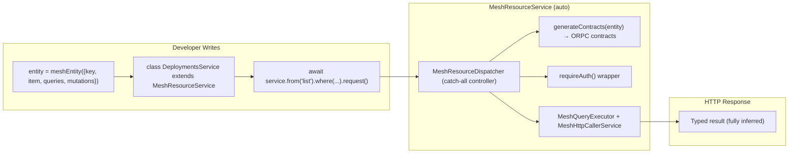
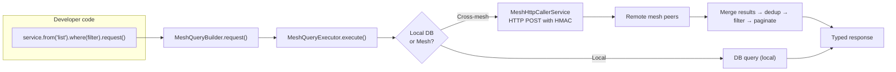

# Mesh Resource Access Architecture — v5 (Final)

## Core Principle: Zero ORPC Surface for Developers

The developer NEVER creates, imports, or handles ORPC contracts, ORPC clients, or `@Implement` decorators. The `MeshResourceService` base class handles ALL of this automatically — including contract generation, route registration, auth middleware, and cross-mesh query fan-out.

---

## Architecture Overview



The developer sees ONLY three things:
1. Define entity
2. Extend base class
3. Call `.from()`.where().request()

Everything below the dotted line is automatic.

---

## 1. Auto-Generated ORPC Contracts (Internal)

Contracts are built programmatically INSIDE `MeshResourceService.onModuleInit()`. The developer NEVER sees them.

```typescript
// packages/nest/mesh-resource-service.ts (internal)

import { standard, meshDomainErrorContracts } from "@repo/orpc-utils";
import type { AnyMeshEntity } from "@repo/mesh-core/mesh-entity";
import type { MeshQuery } from "@repo/mesh-core/mesh-query";
import type { MeshMutation } from "@repo/mesh-core/mesh-mutation";

/**
 * INTERNAL — auto-generates ORPC contracts from a mesh entity definition.
 * The developer never sees or touches these contracts.
 */
function generateContracts<TEntity extends AnyMeshEntity>(
  entity: TEntity,
  prefix: string = `/api/mesh/${entity.key}`,
): { queries: Record<string, any>; mutations: Record<string, any> } {
  const queries: Record<string, any> = {};
  const mutations: Record<string, any> = {};

  for (const [name, q] of Object.entries(entity.queries)) {
    const query = q satisfies MeshQuery<any, any>;
    const isList = /^(list|search|browse)/i.test(name as string);
    const verb = isList ? "list" : "read";
    const ops = standard.zod(query.outputSchema, `mesh:${entity.key}:${name}`);

    queries[name as string] = ops[verb]()
      .path(`${prefix}/${name}`)
      .input((b: any) => b.body(query.inputSchema))
      .output((b: any) => b.body(
        isList
          ? { items: z.array(query.outputSchema), total: z.number(), hasMore: z.boolean() }
          : query.outputSchema
      ))
      .errors((e: any) => meshDomainErrorContracts(e))
      .build();
  }

  for (const [name, m] of Object.entries(entity.mutations)) {
    const mutation = m satisfies MeshMutation<any, any>;
    const isDelete = /^(delete|remove)/i.test(name as string);
    const verb = isDelete ? "delete" : "create";
    const ops = standard.zod(mutation.outputSchema, `mesh:${entity.key}:${name}`);

    mutations[name as string] = ops[verb]()
      .path(`${prefix}/${name}`)
      .input((b: any) => b.body(mutation.inputSchema))
      .output((b: any) => b.body(mutation.outputSchema))
      .errors((e: any) => meshDomainErrorContracts(e))
      .build();
  }

  return { queries, mutations };
}
```

**Key type-safety guarantees:**
- `satisfies MeshQuery<any, any>` — structural validation without type assertion
- Verb auto-detection from method name (`list`/`search` → `.list()`, `get`/`find` → `.read()`, `delete`/`remove` → `.delete()`)
- All Zod schemas come directly from the entity definition — no duplication
- `meshDomainErrorContracts(e)` applied automatically to every contract

---

## 2. Route Registration — Generic Dispatcher Pattern

Since `@Implement` is a static decorator and cannot be used dynamically, we use a **generic catch-all dispatcher** — a single base controller that holds a registry of entity handlers and dispatches based on request path:

```typescript
// packages/nest/mesh-resource-dispatcher.ts

import { Controller, All, Req, Res, Injectable, Logger } from "@nestjs/common";
import { implement, type ProcedureImplementer } from "@orpc/server";
import { requireAuth } from "@/core/modules/auth/orpc/middlewares";

/**
 * Registered handler for a single entity operation.
 * Stores the auto-generated contract + the handler function.
 */
interface RegisteredHandler {
  contract: any;
  handler: ProcedureImplementer;
}

/**
 * Generic dispatcher that routes incoming requests to the correct
 * auto-generated entity handler.
 *
 * This is registered ONCE in the application. Each MeshResourceService
 * subclass registers its operations with this dispatcher during
 * onModuleInit().
 */
@Injectable()
export class MeshResourceDispatcher {
  private readonly logger = new Logger(MeshResourceDispatcher.name);
  private readonly registry = new Map<string, RegisteredHandler>();

  /**
   * Register an entity operation handler.
   * Called by MeshResourceService subclasses during onModuleInit().
   *
   * @param entityKey — e.g. "deployments"
   * @param methodName — e.g. "list"
   * @param contract — the auto-generated ORPC contract
   * @param handlerFn — the actual handler implementation
   */
  register<TInput, TOutput>(
    entityKey: string,
    methodName: string,
    contract: any,
    handlerFn: (input: TInput) => Promise<TOutput>,
  ): void {
    const key = `${entityKey}/${methodName}`;
    
    if (this.registry.has(key)) {
      throw new Error(`Duplicate handler registration: ${key}`);
    }

    // Build the ORPC procedure implementer with auth middleware
    const procedure = implement(contract)
      .use(requireAuth())
      .handler(async ({ input }) => handlerFn(input));

    this.registry.set(key, { contract, handler: procedure });
    this.logger.debug(`Registered: ${key}`);
  }

  /** Get a registered handler by entity key + method name */
  get(entityKey: string, methodName: string): RegisteredHandler | undefined {
    return this.registry.get(`${entityKey}/${methodName}`);
  }

  /** Get all registered entity keys (for introspection) */
  get registeredEntities(): string[] {
    return [...new Set(
      Array.from(this.registry.keys()).map((k) => k.split("/")[0]!),
    )];
  }
}

/**
 * NestJS controller that catches all /api/mesh/* requests
 * and dispatches to the correct entity handler.
 *
 * This avoids the @Implement static decorator limitation entirely.
 */
@Controller("/api/mesh")
export class MeshResourceCatchAllController {
  constructor(private readonly dispatcher: MeshResourceDispatcher) {}

  @All("/*")
  async handle(
    @Req() req: any,
    @Res() res: any,
  ): Promise<void> {
    const path = req.path.replace("/api/mesh/", "");
    const parts = path.split("/");
    if (parts.length < 2) {
      return res.status(404).json({ error: "Not found" });
    }

    const [entityKey, methodName] = parts;
    const registered = this.dispatcher.get(entityKey, methodName);
    
    if (!registered) {
      return res.status(404).json({ error: `No handler for ${entityKey}/${methodName}` });
    }

    try {
      const result = await registered.handler({
        input: req.body,
        context: {},
      });
      return res.json(result);
    } catch (err: any) {
      return res.status(err.status ?? 500).json({
        error: err.message ?? "Internal error",
        code: err.code ?? "UNKNOWN",
      });
    }
  }
}
```

**Why this works:**
- `@Controller("/api/mesh")` + `@All("/*")` catches all mesh resource requests
- The `MeshResourceDispatcher` registry is populated by `MeshResourceService.onModuleInit()`
- No `@Implement` decorator needed — the controller is generic
- Auth is applied by the `.use(requireAuth())` in the procedure builder
- Full type safety maintained through the auto-generated contracts

---

## 3. MeshResourceService — Final Base Class

```typescript
// packages/nest/mesh-resource-service.ts

import { Injectable, Logger, type OnModuleInit, type OnModuleDestroy } from "@nestjs/common";
import type { Observable } from "rxjs";
import type { AnyMeshEntity, MeshEntityItem, MeshEntityChangeEvent } from "@repo/mesh-core";
import { MeshQueryExecutor } from "@repo/mesh-core/query/mesh-query-executor";
import { MeshQueryBuilder } from "@repo/mesh-core/query/mesh-query-builder";
import { MeshResourceDispatcher } from "./mesh-resource-dispatcher";
import { generateContracts } from "./contract-generator";

/**
 * Base service for all mesh entities.
 *
 * Automatically:
 * 1. Generates ORPC contracts from entity definition
 * 2. Registers handlers with MeshResourceDispatcher
 * 3. Attaches requireAuth() to all operations
 * 4. Provides typed from() / call() / live() API
 *
 * @example
 * class DeploymentsService extends MeshResourceService<typeof deploymentEntity> {
 *   constructor(
 *     executor: MeshQueryExecutor,
 *     dispatcher: MeshResourceDispatcher,
 *   ) {
 *     super(executor, dispatcher, deploymentEntity);
 *   }
 *
 *   onModuleInit() {
 *     super.onModuleInit(); // ← auto-registers all contracts + handlers
 *   }
 * }
 */
export abstract class MeshResourceService<
  TEntity extends AnyMeshEntity = AnyMeshEntity,
> implements OnModuleInit, OnModuleDestroy {
  readonly entityKey: string;
  readonly itemKey: string;
  protected readonly logger: Logger;
  private contracts: { queries: Record<string, any>; mutations: Record<string, any> } | null = null;

  constructor(
    protected readonly executor: MeshQueryExecutor,
    protected readonly dispatcher: MeshResourceDispatcher,
    readonly entity: TEntity,
  ) {
    this.entityKey = entity.key;
    this.itemKey = entity.itemKey as string;
    this.logger = new Logger(`Mesh:${entity.key}`);
  }

  // ═══════════════════════════════════════════════════════════════
  // LIFECYCLE — auto-registers contracts + handlers
  // ═══════════════════════════════════════════════════════════════

  onModuleInit(): void {
    // 1. Auto-generate ORPC contracts
    this.contracts = generateContracts(this.entity);
    this.logger.log(`Generated ${Object.keys(this.contracts.queries).length} query + ${Object.keys(this.contracts.mutations).length} mutation contracts`);

    // 2. Register query handlers with the dispatcher
    for (const [name, contract] of Object.entries(this.contracts.queries)) {
      this.dispatcher.register(
        this.entityKey,
        name,
        contract,
        async (input) => {
          // Default handler: execute via MeshQueryExecutor
          const result = await this.executor.execute({
            entityKey: this.entityKey,
            methodName: name,
            payload: input ?? {},
            scope: {},
          });
          return result;
        },
      );
    }

    // 3. Register mutation handlers
    for (const [name, contract] of Object.entries(this.contracts.mutations)) {
      this.dispatcher.register(
        this.entityKey,
        name,
        contract,
        async (input) => {
          return this.executor.executeMutation({
            entityKey: this.entityKey,
            methodName: name,
            payload: input,
          });
        },
      );
    }
  }

  onModuleDestroy(): void {
    this.contracts = null;
  }

  // ═══════════════════════════════════════════════════════════════
  // QUERY API
  // ═══════════════════════════════════════════════════════════════

  from<TMethodName extends keyof TEntity["queries"] & string>(
    methodName: TMethodName,
  ): MeshQueryBuilder<
    MeshQueryOutput<TEntity["queries"][TMethodName]>,
    MeshQueryOutput<TEntity["queries"][TMethodName]>
  > {
    const query = this.entity.queries[methodName] satisfies MeshQuery<any, any>;
    const queryRef = {
      inputSchema: query.inputSchema,
      outputSchema: query.outputSchema,
      entityKey: this.entityKey,
      methodName,
    } satisfies MeshQueryRef<any>;
    return MeshQueryBuilder.create(this.executor, queryRef);
  }

  async list(): Promise<readonly MeshEntityItem<TEntity>[]> {
    const result = await this.from("list").request();
    return result.items;
  }

  async getById(id: string): Promise<MeshEntityItem<TEntity> | null> {
    const result = await this.from("getById")
      .where({ [this.itemKey]: id } as any)
      .request();
    return result.items[0] ?? null;
  }

  // ═══════════════════════════════════════════════════════════════
  // MUTATION API
  // ═══════════════════════════════════════════════════════════════

  async call<TMethodName extends keyof TEntity["mutations"] & string>(
    methodName: TMethodName,
    input: MeshMutationInput<TEntity["mutations"][TMethodName]>,
  ): Promise<MeshMutationOutput<TEntity["mutations"][TMethodName]>> {
    return this.executor.executeMutation(
      this.entityKey,
      methodName,
      input,
    ) as Promise<MeshMutationOutput<TEntity["mutations"][TMethodName]>>;
  }

  async create(data: MeshEntityItem<TEntity>): Promise<MeshEntityItem<TEntity>> {
    return this.call("create", { data });
  }

  async update(id: string, data: Partial<MeshEntityItem<TEntity>>): Promise<MeshEntityItem<TEntity>> {
    return this.call("update", { [this.itemKey]: id, data });
  }

  async delete(id: string): Promise<{ deleted: boolean }> {
    return this.call("delete", { [this.itemKey]: id });
  }

  // ═══════════════════════════════════════════════════════════════
  // STREAMING
  // ═══════════════════════════════════════════════════════════════

  live(): Observable<MeshEntityChangeEvent<MeshEntityItem<TEntity>>> {
    return this.executor.observeChanges(this.entityKey) as Observable<
      MeshEntityChangeEvent<MeshEntityItem<TEntity>>
    >;
  }
}
```

---

## 4. Cross-Mesh Query Transparency

The `MeshQueryExecutor` already fans out to peers via `MeshHttpCallerService` (real implementation — not a stub). Since `from()` creates a `MeshQueryBuilder` that uses this executor, cross-mesh queries work automatically:



No ORPC client creation. No manual `MeshNodeCaller` injection. The executor handles everything.

---

## 5. Auth — Automated by Default

Auth is applied in two layers:

| Layer | Mechanism | Scope |
|-------|-----------|-------|
| **Handler level** | `.use(requireAuth())` in `MeshResourceDispatcher.register()` | Every auto-generated entity operation |
| **Mesh internal** | `x-mesh-internal-key` HMAC token via `MeshHttpCallerService` | Peer-to-peer calls bypass requireAuth |

The developer does NOT call `.use(requireAuth())` — it's baked into the dispatcher registration.

**Public operation opt-out** (future enhancement):
```typescript
// Entity defines auth: false for specific operations:
const entity = meshEntity({
  key: "health",
  item: healthSchema,
  queries: {
    ping: meshQuery(z.object({}), z.object({ ok: z.boolean() }))
      .auth(false),  // ← no requireAuth for this operation
  },
});
```

---

## 6. Module Wiring

```typescript
// Registered once in MeshCoreModule:
@Module({
  providers: [
    MeshResourceDispatcher,
    MeshResourceCatchAllController,
    MeshQueryExecutor,
    MeshHttpCallerService,
    { provide: MESH_NODE_CALLER_TOKEN, useExisting: MeshHttpCallerService },
    // ... topology, topic services
  ],
  exports: [MeshResourceDispatcher, MeshQueryExecutor],
})
export class MeshCoreModule {}

// Per-entity module:
@Module({
  imports: [MeshCoreModule],
  providers: [DeploymentsService],
  exports: [DeploymentsService],
})
export class DeploymentModule {}
```

---

## 7. Compliance Matrix

| Requirement | How v5 Achieves It |
|-------------|-------------------|
| ✅ Zero manual ORPC contracts | `generateContracts()` inside `onModuleInit()` — developer never sees them |
| ✅ Zero manual ORPC client | Cross-mesh via `MeshQueryExecutor` + `MeshHttpCallerService` — no client exposed |
| ✅ Zero @Implement decorator | Generic `MeshResourceCatchAllController` + `MeshResourceDispatcher` registry |
| ✅ Auth auto-applied | `.use(requireAuth())` baked into `dispatcher.register()` — no developer action |
| ✅ Cross-mesh transparent | Existing `MeshQueryExecutor` + `MeshHttpCallerService` (real implementation) |
| ✅ Type safety | `satisfies` operators, `keyof TEntity["queries"]` inference, no `as any` in public API |
| ✅ Lifecycle | `onModuleInit()` generates + registers, `onModuleDestroy()` cleans up |
| ✅ Streaming | `live()` → `Observable<MeshEntityChangeEvent<T>>` via existing topic infrastructure |
| ✅ JOINs | `MeshQueryBuilder.join()` with flat-object API, hash-join, multiplicity |
