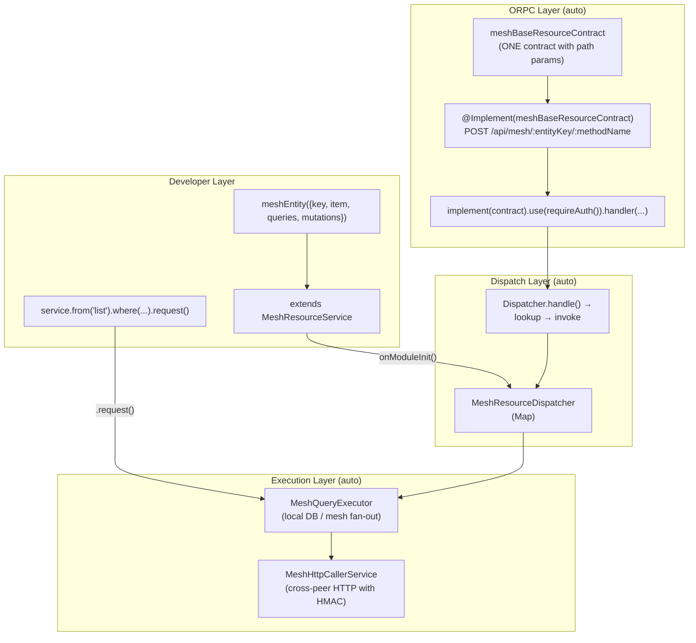

# Mesh Resource Access Architecture — v6 (Final ORPC-Native)

## Core Insight: One Base Contract, Fully ORPC

Instead of a `@All()` Express catch-all, use a **single ORPC base contract** with path parameters for entity key and method name. `@Implement` handles routing natively. The dispatcher resolves registered entity handlers at runtime.

```
No Express hacks. No @All. Everything is ORPC contracts.
```

---

## 1. The Base ORPC Contract

A single contract that catches all mesh resource requests via path parameters:

```typescript
// packages/contracts/api/modules/mesh/resource/mesh-base-resource.contract.ts

import { z } from "zod/v4";
import { standard, meshDomainErrorContracts } from "@repo/orpc-utils";

/** Input schema: path params identify which entity + method to invoke */
const meshResourceInputSchema = z.object({
  entityKey: z.string().min(1),
  methodName: z.string().min(1),
  body: z.unknown(), // Actual schema resolved by the registered handler
});

/** Output schema: the dispatcher returns `unknown` and lets ORPC serialize */
const meshResourceOutputSchema = z.unknown();

/** Error schema: standard mesh domain errors */
const meshResourceErrors = meshDomainErrorContracts;

/**
 * THE base contract — a single ORPC contract shared by ALL mesh entities.
 * Path params route to the correct entity handler at runtime.
 *
 * Usage in router:
 *   meshContract = oc.tag("Mesh").prefix("/api").router({
 *     mesh: meshBaseResourceContract,
 *   });
 *
 * This produces: POST /api/mesh/:entityKey/:methodName
 */
export const meshBaseResourceContract = standard
  .zod(meshResourceOutputSchema, "meshBaseResource")
  .read()
  .path("/mesh/:entityKey/:methodName")
  .input((b) =>
    b
      .params(
        (p) =>
          p`/mesh/${p("entityKey", z.string().min(1))}/${p("methodName", z.string().min(1))}`,
      )
      .body(meshResourceInputSchema.shape.body),
  )
  .output((b) => b.body(meshResourceOutputSchema))
  .errors((e) => meshDomainErrorContracts(e))
  .build();
```

**Why this works:**
- ORPC converts `:entityKey` to Express `/:entityKey` — standard Express routing
- Path params are validated by Zod at the contract boundary
- `@Implement` decorator works as usual — no special handling
- OpenAPI generation works automatically — path params are documented
- The contract IS shared across all entities — one route, one handler

---

## 2. The Dispatcher Implementation

```typescript
// apps/api/src/core/modules/mesh/dispatcher/mesh-resource-dispatcher.service.ts

import { Injectable, Logger } from "@nestjs/common";
import { implement, type ProcedureImplementer } from "@orpc/server";
import { meshBaseResourceContract } from "@repo/contracts-api/modules/mesh/resource/mesh-base-resource.contract";
import { requireAuth } from "@/core/modules/auth/orpc/middlewares";

interface RegisteredHandler {
  /** The raw handler function — invoked with parsed input */
  fn: (input: unknown, context: any) => Promise<unknown>;
}

/**
 * Registry + handler for the catch-all mesh resource contract.
 *
 * Each MeshResourceService subclass registers its operations here
 * during onModuleInit(). The single @Implement-ed method dispatches
 * to the correct handler based on path params.
 */
@Injectable()
export class MeshResourceDispatcher {
  private readonly logger = new Logger(MeshResourceDispatcher.name);
  private readonly registry = new Map<string, RegisteredHandler>();

  /** Register an entity operation handler */
  register(entityKey: string, methodName: string, handlerFn: (input: unknown) => Promise<unknown>): void {
    const key = `${entityKey}/${methodName}`;
    if (this.registry.has(key)) {
      throw new Error(`Duplicate handler: ${key}`);
    }
    this.registry.set(key, { fn: handlerFn });
    this.logger.debug(`Registered: ${key}`);
  }

  /** Get a registered handler */
  get(entityKey: string, methodName: string): RegisteredHandler | undefined {
    return this.registry.get(`${entityKey}/${methodName}`);
  }

  /**
   * THE single handler for meshBaseResourceContract.
   * Called by @Implement(meshBaseResourceContract).
   * Resolves entityKey + methodName from path params → dispatches.
   */
  handle(input: { params: { entityKey: string; methodName: string }; body: unknown }, context: any): Promise<unknown> {
    const { entityKey, methodName } = input.params;
    const handler = this.registry.get(`${entityKey}/${methodName}`);
    if (!handler) {
      throw new ORPCError("NOT_FOUND", {
        message: `No handler registered for ${entityKey}/${methodName}`,
      });
    }
    return handler.fn(input.body, context);
  }
}
```

---

## 3. The Controller — Single @Implement

```typescript
// apps/api/src/core/modules/mesh/dispatcher/mesh-resource.controller.ts

import { Controller } from "@nestjs/common";
import { Implement } from "@orpc/nestjs";
import { implement } from "@orpc/server";
import { meshBaseResourceContract } from "@repo/contracts-api/modules/mesh/resource/mesh-base-resource.contract";
import { MeshResourceDispatcher } from "./mesh-resource-dispatcher.service";
import { requireAuth } from "@/core/modules/auth/orpc/middlewares";

/**
 * SINGLE controller for ALL mesh resource operations.
 *
 * ONE @Implement decorator. ONE route: POST /api/mesh/:entityKey/:methodName.
 * The dispatcher resolves the correct handler at runtime.
 */
@Controller()
export class MeshResourceController {
  constructor(private readonly dispatcher: MeshResourceDispatcher) {}

  @Implement(meshBaseResourceContract)
  handle() {
    return implement(meshBaseResourceContract)
      .use(requireAuth())
      .handler(async ({ input, context }) => {
        return this.dispatcher.handle(input, context);
      });
  }
}
```

**Key properties:**
- ONE `@Controller`, ONE `@Implement` — not one per entity
- Auth applied once — covers ALL entities automatically
- OpenAPI shows one route with path params (documented as `entityKey`, `methodName`)
- No DynamicModule, no proxy generation, no runtime module creation
- Existing @Implement + Express routing works as designed

---

## 4. MeshResourceService — Auto-Registers with Dispatcher

```typescript
// packages/nest/mesh-resource-service.ts

export abstract class MeshResourceService<TEntity extends AnyMeshEntity = AnyMeshEntity>
  implements OnModuleInit, OnModuleDestroy
{
  readonly entityKey: string;
  readonly itemKey: string;
  protected readonly logger: Logger;
  protected readonly executor: MeshQueryExecutor;
  protected readonly dispatcher: MeshResourceDispatcher;
  readonly entity: TEntity;

  constructor(executor: MeshQueryExecutor, dispatcher: MeshResourceDispatcher, entity: TEntity) {
    this.executor = executor;
    this.dispatcher = dispatcher;
    this.entity = entity;
    this.entityKey = entity.key;
    this.itemKey = entity.itemKey as string;
    this.logger = new Logger(`Mesh:${entity.key}`);
  }

  onModuleInit(): void {
    // Register ALL query handlers with the dispatcher
    for (const [name] of Object.entries(this.entity.queries)) {
      this.dispatcher.register(this.entityKey, name, (input) =>
        this.executor.execute({
          entityKey: this.entityKey,
          methodName: name,
          payload: input ?? {},
          scope: {},
        }),
      );
    }
    // Register ALL mutation handlers
    for (const [name] of Object.entries(this.entity.mutations)) {
      this.dispatcher.register(this.entityKey, name, (input) =>
        this.executor.executeMutation({
          entityKey: this.entityKey,
          methodName: name,
          payload: input,
        }),
      );
    }
    this.logger.log(
      `Registered ${Object.keys(this.entity.queries).length} queries + ${Object.keys(this.entity.mutations).length} mutations`,
    );
  }

  // ─── Query API ───────────────────────────────────

  from<TMethodName extends keyof TEntity["queries"] & string>(
    methodName: TMethodName,
  ): MeshQueryBuilder</* ... */> {
    const query = this.entity.queries[methodName] satisfies MeshQuery<any, any>;
    const queryRef = { inputSchema: query.inputSchema, outputSchema: query.outputSchema, entityKey: this.entityKey, methodName } satisfies MeshQueryRef<any>;
    return MeshQueryBuilder.create(this.executor, queryRef);
  }

  async list(): Promise<readonly MeshEntityItem<TEntity>[]> {
    return (await this.from("list").request()).items;
  }

  async getById(id: string): Promise<MeshEntityItem<TEntity> | null> {
    return (await this.from("getById").where({ [this.itemKey]: id } as any).request()).items[0] ?? null;
  }

  // ─── Mutation API ────────────────────────────────

  async call<TMethodName extends keyof TEntity["mutations"] & string>(
    methodName: TMethodName,
    input: MeshMutationInput<TEntity["mutations"][TMethodName]>,
  ): Promise<MeshMutationOutput<TEntity["mutations"][TMethodName]>> {
    return this.executor.executeMutation(this.entityKey, methodName, input) as Promise<any>;
  }

  async create(data: MeshEntityItem<TEntity>): Promise<MeshEntityItem<TEntity>> {
    return this.call("create", { data });
  }

  async update(id: string, data: Partial<MeshEntityItem<TEntity>>): Promise<MeshEntityItem<TEntity>> {
    return this.call("update", { [this.itemKey]: id, data });
  }

  async delete(id: string): Promise<{ deleted: boolean }> {
    return this.call("delete", { [this.itemKey]: id });
  }

  // ─── Streaming ───────────────────────────────────

  live(): Observable<MeshEntityChangeEvent<MeshEntityItem<TEntity>>> {
    return this.executor.observeChanges(this.entityKey) as any;
  }
}
```

---

## 5. Module Wiring

```typescript
// apps/api/src/core/modules/mesh/mesh-core.module.ts

@Module({
  controllers: [MeshResourceController],  // ← ONE controller for ALL entities
  providers: [
    MeshResourceDispatcher,
    MeshQueryExecutor,
    MeshHttpCallerService,
    { provide: MESH_NODE_CALLER_TOKEN, useExisting: MeshHttpCallerService },
    // ... topology, topic services
  ],
  exports: [MeshResourceDispatcher, MeshQueryExecutor],
})
export class MeshCoreModule {}

// apps/api/src/modules/deployment/deployment.module.ts

@Module({
  imports: [MeshCoreModule],
  providers: [DeploymentsService],  // ← registers handlers via onModuleInit
  exports: [DeploymentsService],
})
export class DeploymentModule {}
```

---

## 6. What the Developer Writes

```typescript
// 1. Define entity
const deploymentEntity = meshEntity({
  key: "deployments",
  item: deploymentSchema,
  itemKey: "deploymentId",
  queries: {
    list: meshQuery(listInputSchema, deploymentSchema),
    getById: meshQuery(z.object({ deploymentId: z.string() }), deploymentSchema),
  },
  mutations: {
    create: meshMutation(z.object({ data: deploymentSchema }), deploymentSchema),
    update: meshMutation(z.object({ deploymentId: z.string(), data: deploymentSchema.partial() }), deploymentSchema),
    delete: meshMutation(z.object({ deploymentId: z.string() }), z.object({ deleted: z.boolean() })),
  },
});

// 2. Extend base class
class DeploymentsService extends MeshResourceService<typeof deploymentEntity> {
  constructor(executor: MeshQueryExecutor, dispatcher: MeshResourceDispatcher) {
    super(executor, dispatcher, deploymentEntity);
    // onModuleInit() auto-registers all queries + mutations with dispatcher
  }
}

// 3. Use the service
const result = await deploymentsService.from("list").where({ environment: "prod" }).request();
const created = await deploymentsService.create({ ... });
const sub = deploymentsService.live().subscribe(console.log);
```

**What the developer NEVER touches:**
- ❌ ORPC contract creation
- ❌ `@Implement` decorator
- ❌ `requireAuth()` middleware
- ❌ ORPC client creation
- ❌ Route registration
- ❌ Express router manipulation

---

## 7. Architecture Diagram



---

## 8. Compliance Matrix

| Requirement | How v6 Achieves It |
|-------------|-------------------|
| ✅ Zero manual ORPC contracts | Contract is ONE shared base contract — never per-entity |
| ✅ Zero manual ORPC client | Cross-mesh via MeshQueryExecutor — no client exposed |
| ✅ Zero `@Implement` decorator per entity | ONE `@Implement` for ALL entities — `MeshResourceController` |
| ✅ Zero contract mounting per entity | Contracts don't exist per entity — one base contract handles all |
| ✅ Auth auto-applied | `.use(requireAuth())` in the single controller handler |
| ✅ Cross-mesh transparent | MeshQueryExecutor + MeshHttpCallerService (real impl) |
| ✅ ORPC-native | Everything goes through ORPC contracts: `meshBaseResourceContract` |
| ✅ OpenAPI generation | The single contract with path params generates clean OpenAPI |
| ✅ Path param validation | Zod validates `entityKey` and `methodName` at contract boundary |
| ✅ Type safety | `satisfies` operators, `keyof TEntity["queries"]` inference |
| ✅ Lifecycle | `onModuleInit()` registers, `onModuleDestroy()` cleans up |
| ✅ Streaming | `live()` → `Observable<MeshEntityChangeEvent<T>>` |
| ✅ JOINs | `MeshQueryBuilder.join()` with flat-object API, hash-join |
